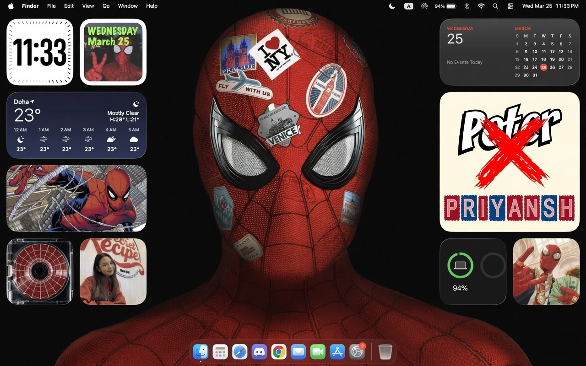

# Priyanshu Anand

<h3 align="left">Full-Stack Developer • GenAI Developer</h3>

---

## About Me

  

> **"With great power comes great responsibility."** 

Building products is more fun than collecting tutorial certificates.

I enjoy building full stack applications, integrating GenAI into real products, designing scalable backends, and shipping ideas that people can actually use.

---

## Tech I Enjoy Working With

  

---

## Featured Projects

| Project | Description | Tech Stack | Live |
| :------ | :---------- | :--------- | :--- |
| **EduSphere** | AI-powered education platform for smarter learning. | Next.js • Node.js • MongoDB • OpenAI | [Live](https://edusphere.live) |
| **Argon AI** | AI-powered application focused on practical productivity. | React • TypeScript • OpenAI | [Live](https://argon.priyanshu.cv) |
| **PR Panda** | AI-powered content & productivity assistant. | Next.js • PostgreSQL • Express | [Live](https://prpanda.priyanshu.cv) |
| **Kishansathi** | Agriculture-focused digital platform. | React • Node.js • MongoDB | [Live](https://kishansaathi.priyanshu.cv/) |
| **LaFleure IQ** | AI productivity workspace. | Next.js • TypeScript • Firebase | [Live](https://lafleuriq.vercel.app/) |
| **Churn Analysis Dashboard** | Business analytics dashboard for customer retention insights. | Python • SQL • PostgreSQL | [Live](https://customer-churn-prediction11.streamlit.app/) |
| **Portfolio Website** | Personal portfolio showcasing projects and experience. | Next.js • Tailwind CSS • TypeScript | [Live](https://priyanshu.cv) |

---

## Currently Learning

* System Design
* AI Agents
* LLM Engineering
* Cloud Computing
* Docker

---

## Connect

  

  

  

  

  

  

---

## Featured Video

  

  <strong>Watch the complete project walkthrough on YouTube.</strong>

---

## Fun Facts

* I build more projects than I finish Netflix shows.
* AI is my favorite debugging partner.
* I enjoy solving backend problems.
* I learn by building.
* Always exploring new technologies.

---

## Quote

> **"Building software that people love to use."**
